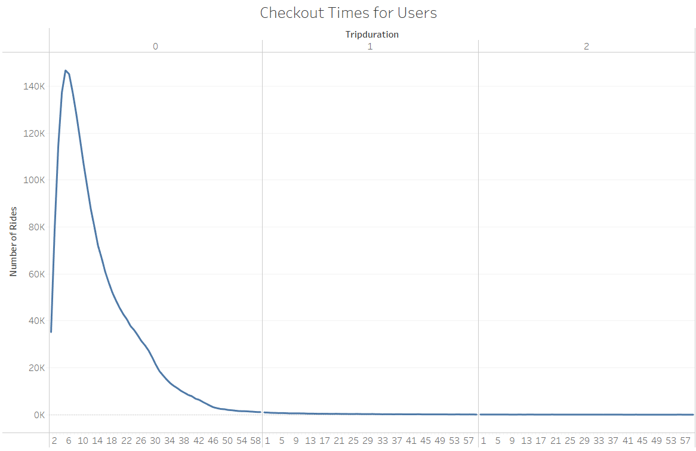

# bikesharing

## Overview of the analysis

This project seeks to analyze data from City bikes from NY in order to present a strong proposal to convince investors that a bike- sharing program in Des Moines would be a great business. This anlysis shows relevant insights from the business regarding different type of customers, peak riding hours, trips by gender, etc. 

## Results

### Customer types

The pie chart above shows that there are two types of customers, annual subscribers and short term customers. The proportion of annual subscribers is way greater than short term customers. 

### Peak Riding Hours

The bar chart above shows that the top riding hours in August are from 5:00 to 7:00 pm. 

### Checkout Times by Users

The graph above portrays that most of the ride´s duration is of 5 minutes. It also shows that most rides tend to be of less than 1 hour.

### Checkout Times by Gender

This graph shows the lenght of time that bikes are checked out of for each gender. Males are the main customers to this bike service.

### Trips by Weekday per Hour

The graph above shows that for monday to friday the highest number of trips are within 7 to 9 am and from 5 to 7 pm. For weekends the highest number of trips are from 10 am to 7 pm. 

### Trips by gender (weekday per hour)

.png)

The graph above shows that males are the most predominant user of this service. The highest number of trips occur during 5 to 6 pm on Thursday.

### User Trips by Gender by Weekday 

The graph above shows that males subscribers tend to use bike service most on Thursday and Fridays. 

## Summary 

In general we could conclude the following:
  -There is a total of 2,344,2444 users for this type of service. From this number 81% of the users are annual subscribers and the rest are short term customers. 
  -Top riding hours are between 5:00 pm to 7:00 pm.
  -The day with the highest number of rides is Thursdays. 
  -Males are the most predominant users of the service. 
  -Most rides on weekend take place between 10:00am to 7:00 pm. And from Monday to Friday trips start earlier, from 7:00 am to 9:00 am and then have high number of       rides at 5:00 pm to 7:00 pm.
  
For future anylisis it is suggested to:
- create a map to show the top starting and ending locations by gender
- create a tavle that shows which bikes are eligible for repair

Link to Public Tableau : https://public.tableau.com/app/profile/monica.ramos.belmont/viz/NYCCitibike_16592352951700/NYCCitibike?publish=yes

